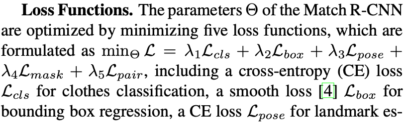

# Notes for DeepFashion2

[Article](./1901.07973.pdf)

## Match R-CNN

Match R-CNN is built based on Mask R-CNN. We use https://github.com/facebookresearch/Detectron as framework. As can be seen from the Diagram of MatchR-CNN in our paper, you only need add the MN branch since FN and PN are provided in Mask R-CNN.

### Structure

Each image is passed through three main components including a Feature Network (FN), a Perception Network (PN), and a Matching Network (MN).

In the first stage, FN contains a ResNet-FPN backbone, a region proposal network (RPN) and RoIAlign module. An image is first fed into ResNet50 to extract features, which are then fed into a FPN that uses a top-down architecture with lateral connections to build a pyramid of feature maps. RoIAlign extracts features from different levels of the pyramid map.

In the second stage, PN contains three streams of networks including landmark estimation, clothes detection, and mask prediction as shown in Fig.4. The extracted RoI features after the first stage are fed into three streams in PN separately. The clothes detection stream has two hidden fully-connected (fc) layers, one fc layer for classification, and one fc layer for bounding box regression. The stream of landmark estimation has 8 ‘conv’ layers and 2 ‘deconv’ layers to predict landmarks. Segmentation stream has 4 ‘conv’ layers, 1 ‘deconv’ layer, and another ‘conv’ layer to predict masks.

In the third stage, MN contains a feature extractor and a similarity learning network for clothes retrieval. The learned RoI features after the FN component are highly discriminative with respect to clothes category, pose, and mask. They are fed into MN to obtain features vectors for retrieval, where v1 and v2 are passed into the similarity learning network to obtain the similarity score between the detected clothing items in I1 and I2. Specifically, the feature extractor has 4 ‘conv’ layers, one pooling layer, and one fc layer. The similarity learning network consists of subtraction and square operator and a fc layer, which estimates the probability of whether two clothing items match or not.

### Loss Functions

### Benchmarks

### Results

### Implementation

In our experiments, each training image is resized to its shorter edge of 800 pixels with its longer edge that is no more than 1333 pixels. Each minibatch has two images in a GPU and 8 GPUs are used for training. For minibatch size 16, the learning rate (LR) schedule starts at 0.02 and is decreased by a factor of 0.1 after 8 epochs and then 11 epochs, and finally terminates at 12 epochs. This scheduler is denoted as 1x. Mask R-CNN adopts 2x schedule for clothes detection and segmentation where ‘2x’ is twice as long as 1x with the LR scaled proportionally. Then It adopts s1x for landmark and pose estimation where s1x scales the 1x schedule by roughly 1.44x. Match R-CNN uses 1x schedule for consumer-to-shop clothes retrieval. The above models are trained by using SGD with a weight decay of $10^{−5}$ and momentum of 0.9.

[Mask R-CNN Segmentation](https://github.com/facebookresearch/detectron2/tree/master/configs/COCO-InstanceSegmentation)
